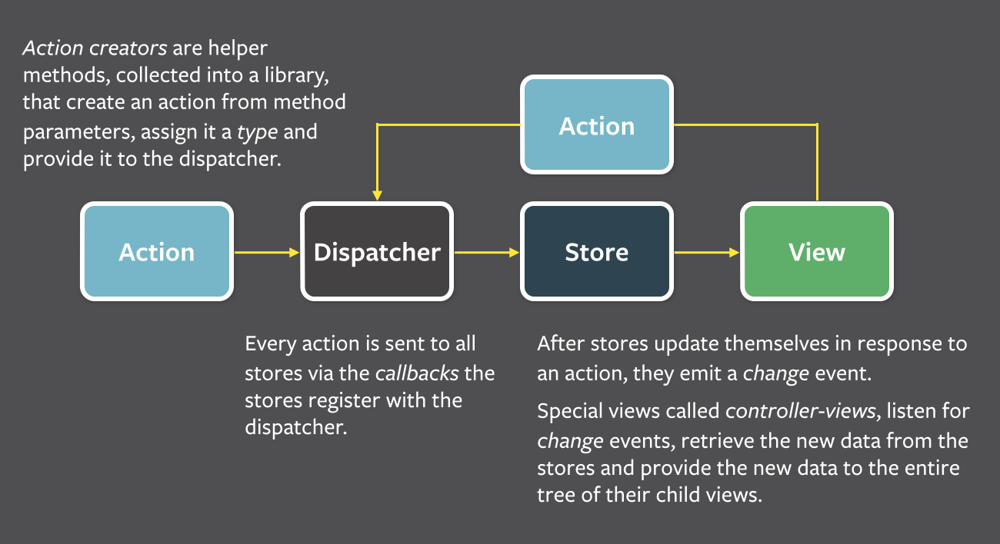

# learning-react-flux

This project is based on my studies on React, React Router, and Flux for building web applications.

It also includes some topics like gulp, browserify and bootstrap.

# Steps done in this project

+ Setup the gulp in the project;
+ Setup the browserify in the project;
+ Setup the bootstrap;
+ Setup ESLint (ESLint is a tool for identifying and reporting errors on patterns found in ECMAScript/JavaScript code);
+ Setup React (it's a javascript library for creating user interfaces. It was built to solve one problem: building large applications with data that changes over time);
+ Setup React Router;
+ Setup lodash (A modern JavaScript utility library delivering modularity, performance, & extras);

# Concepts

+ React Router: it keeps your UI in sync with the URL. It has a simple API with powerful features like lazy code loading, dynamic route matching, and location transition handling built right in. Make the URL your first thought, not an after-thought.

# Props And State

+ Props - look like HTML attributes, but immutable (e.g. this.props.username);
+ State - holds mutable state (e.g. this.state.username).

# Lifecycle functions for each react component

+ componentWillMount

When: Before initial render, both client and server
Why: Good spot to set initial state

+ componentDidMount

When: After render
Why: Access DOM, integrate with frameworks, set timers, ajax requests

+ componentWillReceiveProps

When: when receiving new props. Not called on initial render.
Why: Set state before a render.

+ shouldComponentUpdate

When: before render when new props or state are being received.
Not called on initial render.

Why: Performance. Return false to void unnecessary re-renders.

+ componentWillUpdate

When: Immediately before rendering when new props or state are being received. Not called on initial render.
Why: Prepare for an update.

+ componentDidUpdate

When: after component's updates are flushed to the DOM. Not called for the initial render.
Why: work with the DOM after an update.

+ componentWillUnmount

When: Immediately before component is removed from the DOM.
Why: cleanup.

# Summary of Dynamic Data and Lifecycle

+ Props: they are used to pass data to child components;
+ State: Data in controller view;
+ Lifecycle: handle bootstrapping and third party integrations (http://facebook.github.io/react/docs/component-specs.html);

# Composition

Controller View is a react component. It is also:

+ Top level component;
+ Sets props on children;
+ Interacts with stores (flux);

Notes: It's recommended to have a single top-level controller view that interacts with the store,
and passes all the necessary data down to the children.
Another quick note is - it's possible to nest your controller views, but it's not recommended to do so,
since it can cause multiple data updates. It can also cause React's render method to get called multiple times.

# Prop Validation (PropTypes)

Prop types are a great way to be explicit about the data that we are expect to see in our component's properties.

We can specify that certain properties are required, and also specify the data types for each prop, such as string, bool, interger, etc.

Prop types are simply a map that lets us specify a validation function for each property.

When it fails, a warning is logged in our console (browser).

E.g.

propTypes: {
  author:     React.PropTypes.object.isRequired,
  onSave:     React.PropTypes.func.isRequired,
  validate:   React.PropTypes.func.isRequired,
  errors:     React.PropTypes.object,
  hasErrors:  React.PropTypes.func.isRequired
}

# Mixins

Share behavior among multiple components.

# React Router

+ Nested views map to nested routes
+ Declarative
+ it is also used by facebook

## Handling Transitions

+ willTransitionTo - Determine if page should be transitioned to.
+ willTransitionFrom - Run checks before user navigates away.

# Flux Architecture

Flux is the application architecture that Facebook uses for building client-side web applications. It complements React's composable view components by utilizing a unidirectional data flow. It's more of a pattern rather than a formal framework, and you can start using Flux immediately without a lot of new code.

Flux applications have three major parts: the dispatcher, the stores, and the views (React components). These should not be confused with Model-View-Controller. Controllers do exist in a Flux application, but they are controller-views — views often found at the top of the hierarchy that retrieve data from the stores and pass this data down to their children. Additionally, action creators — dispatcher helper methods — are used to support a semantic API that describes all changes that are possible in the application. It can be useful to think of them as a fourth part of the Flux update cycle.

Reference: https://facebook.github.io/flux/docs/overview.html

## Flux example

+ AuthorList.js (ReactView)
+ AuthorAction.js (Action)
+ Dispatcher notify all the stores (Dispatcher)
+ AuthorStore.js (Store)
